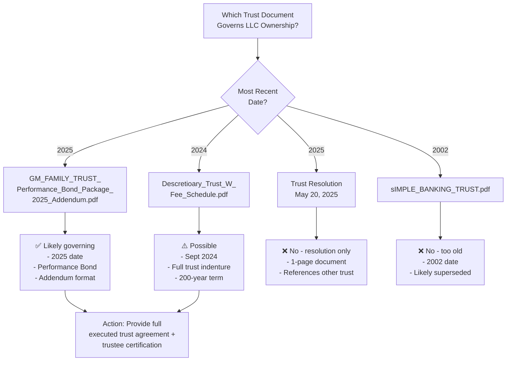

# SOVR DEVELOPMENT HOLDINGS, LLC - COMPLETE PROCESS MAP

## Executive Summary
This diagram outlines the **current state** vs **required state** for your $12M financing, with specific action items to close gaps.

---

## Mermaid Flowchart

```mermaid
flowchart TD
    Start([开始: Current State<br/>2025-03-31]) --> A[Entity Structure Analysis]

    A --> B{Trust Ownership<br/>Established?}
    B -->|Yes| C[GM Family Trust<br/>owns LLC]
    B -->|No| B1[⚠️ CRITICAL GAP:<br/>No proof of trust ownership]

    C --> D{LLC Operating<br/>Agreement?}
    D -->|Yes| E[✅ Management authority<br/>defined]
    D -->|No| D1[🚨 BLOCKER:<br/>No operating agreement]

    E --> F{Membership<br/>Interest Assigned?}
    F -->|Yes| G[✅ Clear chain of title<br/>to 400k shares]
    F -->|No| F1[🚨 BLOCKER:<br/>How did trust acquire LLC?]

    G --> H{FinCEN BOI<br/>Filed?}
    H -->|Yes| I[✅ Beneficial ownership<br/>reported]
    H -->|No| H1[⚠️ HIGH PRIORITY:<br/>$500/day penalty]

    I --> J{Certificate of<br/>Good Standing?}
    J -->|Yes| K[✅ Wyoming compliant]
    J -->|No| J1[⚠️ Need current cert<br/>(~$15)]

    K --> L{LLC Resolution<br/>for Financing?}
    L -->|Yes| M[✅ Authorizes $12M<br/>+ pledge]
    L -->|No| L1[🚨 PRE-CLOSING:<br/>Must execute before signing]

    M --> N[✅ DILIGENCE READY]
    N --> O[ lender Review]
    O --> P{ lender Approval?}
    P -->|Yes| Q[✅ Term Sheet Signed]
    P -->|No| P1[❌ Deal terminated<br/>or restructure]

    Q --> R[🔧 DOCUMENT PREPARATION]
    R --> S[Loan Agreement<br/>Drafted]
    R --> T[Pledge Agreement<br/>Drafted]
    R --> U[UCC-1 Financing<br/>Statement]
    R --> V[Board/Trust<br/>Resolutions]

    S --> W[📝 SIGNING DAY]
    T --> W
    U --> W
    V --> W

    W --> X[💰 FUNDING DISBURSED]
    X --> Y[🏁 CLOSING COMPLETE]

    %% Gaps Section
    subgraph CriticalGaps [🚨 CRITICAL GAPS TO CLOSE]
        D1[No LLC Operating Agreement]
        F1[No Membership Assignment]
        L1[No Financing Resolution]
        B1[No Trust Ownership Proof]
    end

    subgraph HighPriority [⚠️ HIGH PRIORITY ITEMS]
        H1[FinCEN BOI Not Filed]
        J1[No Certificate of Good Standing]
    end

    %% Required Documents Section
    subgraph RequiredDocs [📄 DOCUMENT CHECKLIST]
        RD1[Wyoming LLC<br/>Operating Agreement]
        RD2[Membership Interest<br/>Assignment]
        RD3[GM Family Trust<br/>Certificate]
        RD4[LLC Resolution<br/>Approving Financing]
        RD5[FinCEN BOI Report<br/>(if not filed)]
        RD6[Wyoming Good<br/>Standing Certificate]
        RD7[Form D Filing<br/>(post-closing)]
    end

    %% Timeline Section
    subgraph Timeline [📅 ACTION TIMELINE]
        TL1[Week 1:<br/>- Draft Operating Agreement<br/>- Membership Assignment<br/>- File FinCEN BOI]
        TL2[Week 2:<br/>- Execute LLC Resolution<br/>- Obtain Good Standing<br/>- Trust certification]
        TL3[Pre-Closing:<br/>- Lender diligence<br/>- Negotiate docs<br/>- Sign term sheet]
        TL4[Closing:<br/>- Sign final docs<br/>- UCC filings<br/>- Fund disbursement]
    end

    %% Connections from gaps to actions
    D1 --> RD1
    F1 --> RD2
    B1 --> RD3
    L1 --> RD4
    H1 --> RD5
    J1 --> RD6
    P --> RD7

    %% Style critical gaps
    style D1 fill:#ff4444,stroke:#222,stroke-width:2px,color:#fff
    style F1 fill:#ff4444,stroke:#222,stroke-width:2px,color:#fff
    style L1 fill:#ff4444,stroke:#222,stroke-width:2px,color:#fff
    style B1 fill:#ff4444,stroke:#222,stroke-width:2px,color:#fff

    %% Style high priority
    style H1 fill:#ffaa00,stroke:#222,stroke-width:2px,color:#000
    style J1 fill:#ffaa00,stroke:#222,stroke-width:2px,color:#000

    %% Style success states
    style N fill:#44cc44,stroke:#222,stroke-width:2px,color:#000
    style X fill:#44cc44,stroke:#222,stroke-width:2px,color:#000
```

---

## 📋 **DETAILED ACTION PLAN BY PRIORITY**

### **🔴 BLOCKERS (Must Fix Before Any Lender Signature)**

| Priority | Document | Status | Required Action | Owner | Timeline |
|----------|----------|--------|----------------|-------|----------|
| **P0** | LLC Operating Agreement | ❌ Missing | Draft & execute Wyoming-compliant agreement naming GM Family Trust as member, Gustavo as Manager with explicit pledge authority | LLC Counsel | **Week 1** |
| **P0** | Membership Interest Assignment | ❌ Missing | Create assignment from original organizer (Frontier Registered Agency) to GM Family Trust with consideration evidence | LLC Counsel | **Week 1** |
| **P0** | LLC Resolution for Financing | ❌ Missing | Pre-closing resolution approving $12M loan + 400k share pledge + signatory authorization | Member/Manager | **Before Closing** |
| **P0** | Trust Ownership Proof | ⚠️ Unclear | Identify which trust instrument governs + provide trustee certification | Trustee | **Week 1** |

### **🟡 HIGH PRIORITY (Fix Immediately)**

| Priority | Document | Status | Required Action | Owner | Timeline |
|----------|----------|--------|----------------|-------|----------|
| **P1** | FinCEN BOI Report | ❓ Unknown | File immediately if not done (deadline passed) → $500/day penalties | Compliance | **IMMEDIATE** |
| **P1** | Certificate of Good Standing | ❌ Missing | Order from Wyoming SOS (~$15, instant PDF) | Registered Agent | **Week 1** |
| **P1** | Trust Document | ⚠️ Multiple | Determine which of 4 trust docs is governing; provide full executed trust agreement | Trustee | **Week 1** |
| **P2** | Form 8832 (Tax Election) | ⚠️ Unclear | File if electing corporate tax (currently default = partnership) | Tax Advisor | **Before Tax Deadline** |

### **🟢 MEDIUM PRIORITY (Pre-/Post-Closing)**

| Priority | Document | Status | Required Action | Owner | Timeline |
|----------|----------|--------|----------------|-------|----------|
| **P3** | SEC Form D Filing | ❌ Not filed | File within 15 days of first lender commitment (Rule 506(b)) | Securities Counsel | **Within 15 days post-closing** |
| **P3** | State Blue Sky Filings | ❌ Unknown | Determine which states require notice (based on lender locations) | Securities Counsel | **Post-closing** |
| **P3** | Bank Account Setup | ⚠️ Partial | Open commercial bank account in LLC name with EIN 39-2332625 | Management | **Pre-first draw** |
| **P4** | Oracle Ledger Verification | ⚠️ Mentioned | Demonstrate dc.sovr.world portal showing $12M allocation | Tech Team | **Post-closing** |

---

## 🎯 **DECISION TREE: Which Trust Document is Governing?**



**Recommendation:** The **Performance Bond Package Addendum (2025)** appears most recent and relevant. But you need to provide the **underlying trust agreement** it references.

---

## 📊 **CURRENT STATE MATRIX**

| Category | Component | Status | Score |
|----------|-----------|--------|-------|
| **Entity Formation** | Wyoming LLC Filed | ✅ Complete | 10/10 |
| | LLC Operating Agreement | ❌ Missing | 0/10 |
| | Membership Interest Assigned | ❌ Missing | 0/10 |
| **Ownership Structure** | Trust Ownership Documented | ⚠️ Unclear | 3/10 |
| | Chain of Title Complete | ❌ No | 0/10 |
| | Beneficial Ownership Filed | ❓ Unknown | ?/10 |
| **Tax & Compliance** | EIN Assigned | ✅ Complete | 10/10 |
| | FinCEN BOI | ❌ Missing | 0/10 |
| | Tax Election (8832) | ⚠️ Unclear | 3/10 |
| **Governance** | Manager Authority | ❌ Not documented | 0/10 |
| | Pledge Authority | ❌ Not documented | 0/10 |
| | Borrowing Authority | ❌ Not documented | 0/10 |
| **Financing Readiness** | LLC Resolution | ❌ Missing | 0/10 |
| | Good Standing Cert | ❌ Missing | 0/10 |
| | Lender Counsel Satisfaction | ❌ Impossible w/o docs | 0/10 |

**Overall Readiness Score: ~15/100**
**Deal Feasibility:** ❌ **NOT FUNDABLE IN CURRENT STATE**

---

## 🚀 **30-DAY ACTION PLAN**

### **Week 1: Foundation Documents**
- [ ] **Day 1-2:** Draft Wyoming LLC Operating Agreement
- [ ] **Day 1-2:** Draft Membership Interest Assignment
- [ ] **Day 2-3:** Identify governing trust instrument
- [ ] **Day 3:** File FinCEN BOI report (emergency)
- [ ] **Day 4:** Order Wyoming Good Standing Certificate
- [ ] **Day 5:** Execute Operating Agreement + Assignment
- [ ] **Day 6:** Prepare LLC Resolution template

**Week 1 Deliverable:** All blocker documents drafted and signed

### **Week 2: Certification & Compliance**
- [ ] **Day 1-2:** Prepare Trust Certification (affidavit)
- [ ] **Day 2-3:** Gather all trust documents into data room
- [ ] **Day 4:** Update Offering Memorandum (loan language cleanup)
- [ ] **Day 5:** Prepare Form D filing package
- [ ] **Day 6:** Begin lender outreach with complete package

**Week 2 Deliverable:** Complete diligence package ready

### **Week 3: Lender Process**
- [ ] **Day 1-5:** Lender meetings, Q&A, due diligence
- [ ] **Day 5-7:** Receive term sheet(s)
- [ ] **Day 7:** Negotiate final terms

**Week 3 Deliverable:** Signed term sheet

### **Week 4: Closing**
- [ ] **Day 1-3:** Final loan documentation drafting
- [ ] **Day 3:** Execute loan agreement + pledge agreement
- [ ] **Day 4:** File UCC-1 financing statements
- [ ] **Day 5:** Satisfy closing conditions
- [ ] **Day 6:** Funding disbursement

**Week 4 Deliverable:** $12M funded

---

## 🔧 **SPECIFIC DOCUMENT REQUIREMENTS**

### **1. Wyoming LLC Operating Agreement (Template Structure)**

```markdown
[SOVR DEVELOPMENT HOLDINGS, LLC]
OPERATING AGREEMENT

Effective Date: [________]
Wyoming Limited Liability Company Act (§17-29-101 et seq.)

ARTICLE I - FORMATION
- Entity name: SOVR Development Holdings, LLC
- Principal office: 2120 Carey Ave, Cheyenne, WY 82001
- Registered agent: Frontier Registered Agency Services LLC
- EIN: 39-2332625

ARTICLE II - MEMBER
- Sole Member: GM Family Trust (EIN: 33-6472099)
- Capital contribution: [Describe trust contribution]
- Membership interest: 100%

ARTICLE III - MANAGEMENT
- Manager: Gustavo Orona Maldonado
- Authority: Full authority to bind LLC, including:
  * Borrow money up to $12,000,000
  * Pledge assets as collateral
  * Incur debt obligations
  * Execute loan documents
  * Grant security interests
- No member approval required for financing transactions

ARTICLE IV - PURPOSE
- Lawful business purposes including:
  * Software development and licensing
  * Financial technology operations
  * Digital asset infrastructure
  * Commercial financing activities

ARTICLE V - TAX
- Tax classification: Partnership (or Corporation if 8832 filed)
- Tax matters partner: [Designated]

ARTICLE VI - BOOKS & RECORDS
- Maintain complete records
- Provide financial statements quarterly

ARTICLE VII - DISSOLUTION
- Upon dissolution, assets distributed to Member

[SIGNATURES]
Gustavo Orona Maldonado, Manager
[Trustee signature block for GM Family Trust]
```

---

### **2. Membership Interest Assignment**

```markdown
MEMBERSHIP INTEREST ASSIGNMENT

Assignor: Frontier Registered Agency Services LLC
Assignee: GM Family Trust
Company: SOVR Development Holdings, LLC
Interest: 100% membership interest

For good and valuable consideration, Assignor hereby transfers all of its
membership interest in SOVR Development Holdings, LLC to Assignee.

Effective Date: [________]

[Signatures]
```

---

### **3. LLC Resolution for Financing** (To be executed pre-closing)

```markdown
LLC MEMBER/MANAGER RESOLUTION
SOVR DEVELOPMENT HOLDINGS, LLC

WHEREAS, the Company seeks senior secured financing;

NOW THEREFORE, it is hereby resolved:

1. APPROVAL: The Company approves the Senior Secured Loan transaction
   withprincipal amount up to $10,000,000 and revolving credit up to $2,000,000.

2. COLLATERAL: The Company authorizes pledge of 400,000 Common Shares
   of the Company as collateral security.

3. SIGNATORIES: Gustavo Orona Maldonado is authorized to:
   - Execute loan documents
   - Execute pledge and security agreements
   - File UCC-1 financing statements
   - Take all actions necessary to consummate transaction

4. RATIFICATION: All prior actions taken in connection with this
   financing are hereby ratified and confirmed.

Adopted: [Date]
GM Family Trust, Member
By: _________________________
    Gustavo Orona Maldonado, Trustee

SOVR DEVELOPMENT HOLDINGS, LLC
By: _________________________
    Gustavo Orona Maldonado, Manager
```

---

## ⚖️ **SECURITIES LAW COMPLIANCE CHECKLIST**

### **Rule 506(b) Safe Harbor Requirements:**

| Requirement | Status | Evidence Needed |
|-------------|--------|-----------------|
| Offer only to accredited investors | ⚠️ Process needed | Verify each lender's accredited status |
| No general solicitation | ✅ Private data room | Access restricted, password protected |
| Form D filing with SEC | ❌ Not filed | File within 15 days of first sale |
| State notice filings (blue sky) | ❌ Not done | File in states where lenders reside |
| Disclosure document | ✅ Offering Memo | Revised with loan-specific language |

---

## 🔍 **LENDER DILIGENCE EXPECTATIONS**

**What sophisticated lenders will ask for:**

1. **Entity Documents**
   - Articles of Organization (filed) ✅
   - Operating Agreement ❌
   - Good Standing Certificate ❌
   - EIN Confirmation ✅
   - BOI Report ❓

2. **Ownership Evidence**
   - Trust ownership of LLC ❌
   - Membership interest assignment ❌
   - Trustee certificates ❌
   - Trust agreement (full) ⚠️ Unclear

3. **Authorization**
   - LLC resolution approving financing ❌
   - Pledge authority documented ❌
   - Signatory authority ❌ (partial)

4. **Compliance**
   - FinCEN BOI filing ❓
   - State registations ✅ (WY)
   - Tax returns (if any) ⚠️ (Form 1065 due 3/15/2026)

5. **Financial**
   - Bank account in LLC name ⚠️
   - Financial statements (if any) ⚠️
   - Oracle Ledger verification ⚠️ (mentioned but not proven)

---

## 📞 **IMMEDIATE NEXT STEPS**

**CLICK HERE TO BEGIN:**

1. **Reply "DRAFT OPERATING AGREEMENT"** → I'll draft proper Wyoming LLC Operating Agreement
2. **Reply "MEMBERSHIP ASSIGNMENT"** → I'll draft Membership Interest Assignment
3. **Reply "LLC RESOLUTION"** → I'll draft financing resolution template
4. **Reply "FINCEN BOI HELP"** → I'll provide FinCEN filing instructions
5. **Reply "FIX OFFERING MEMO"** → I'll revise COM to remove securities language

---

**Critical Reminder:** Without the **4 blocker documents** (Operating Agreement, Membership Assignment, Financing Resolution, Trust Certification), **no lender will even term sheet this deal**.

Do you want me to start drafting these documents now?
