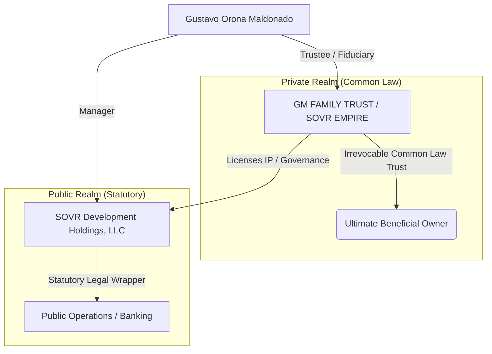

# SOVR CORPORATE ASSESSMENT & PROSPECTUS REVIEW
**Date:** March 30, 2026  
**Status:** CONFIDENTIAL / INTERNAL USE ONLY  
**Subject:** Sovereign Value Attestation Layer (VAL) Core & SOVR Digital Ecosystem

---

## 1. Executive Summary
The SOVR Digital Ecosystem is a "Mechanical Truth" ledger-cleared obligation protocol. It successfully bridges private common law authority with public statutory compliance through a dual-layered corporate structure. The core innovation lies in the **VirtualCardBridge**, which transforms blockchain-locked assets into real-world purchasing power with zero credit risk.

---

## 2. Corporate Structure & Governance
The ecosystem utilizes a **"Trust-Backed Legal Wrapper"** model to maintain private sovereignty while enabling institutional interoperability.

### 2.1 Organizational Hierarchy

*   **GM FAMILY TRUST (dba SOVR EMPIRE):** A private, non-statutory, common law irrevocable trust. It holds all intellectual property and serves as the apex authority.
*   **SOVR Development Holdings, LLC:** A Wyoming-based statutory entity (EIN 39-2332625). It functions as the "Honoring Adapter" for the legacy financial system, managing vendor relationships (Stripe, Lithic) and tax compliance.

---

## 3. The SOVR Protocol: Technical Pillars
The protocol is designed to eliminate the narrative of "debt" by replacing it with "Mechanical Truth."

### 3.1 VirtualCardBridge (SOVRCreditBridgePOS)
*   **Mechanism:** On-chain smart contracts (`SOVRCR1`) lock digital collateral to trigger off-chain virtual card issuance.
*   **Legacy Integration:** Processes **MICR** strings and tracks **ACH** lifecycles directly within the ledger state.
*   **Zero Risk Model:** All credit is 100% pre-funded on-chain. There is no traditional interest-bearing debt or default risk.

### 3.2 Discharge Protocols
Citing **House Joint Resolution 192 (1933)** and **UCC § 3-603**, the ecosystem treats private credit tokens as "prepaid assets." This legal standing allows for the "discharge" of public obligations through set-off, as recognized under **GAAP (ASC 310, 820)**.

---

## 4. Financial Model & Offerings
The ecosystem is currently seeking expansion capital via non-dilutive senior secured funding.

*   **Offering:** Senior Secured Loan.
*   **Collateral:** 400,000 Common Shares of SOVR Development Holdings, LLC.
*   **Rate:** Floating rate based on **SOFR**.
*   **Revenue Streams:** Issuance fees, interchange participation, and asset management within the ReserveManager.

---

## 5. Audit & Compliance
The **Oracle Ledger** (powered by TigerBeetle) provides a real-time, immutable audit trail that mirrors traditional banking statements.

*   **Accounting Standards:** Adherence to **SSAP** and **GAAP**.
*   **Verification Layer:** **AttestorOracleEIP712** provides cryptographic signatures for every off-chain financial event, ensuring the narrative always matches the ledger.

---

## 6. Document Inventory & Categorization
| Category | Key Documents |
| :--- | :--- |
| **Legal** | Trust Declaration, Strategic Legal Wrapper, CP575 Notice, W-9 |
| **Protocol** | SOVR Protocol.pdf, Analysis of the SOVRCreditBridgePOS.pdf |
| **Financial** | Offering Memorandum, SOVR Banking Statement, Accounting.pdf |
| **Operational** | V2 Product Requirements Document, FAQ.pdf, Profile.pdf |

---
**Assessment Prepared By:** Gemini CLI Agent  
**Framework:** RuFlo V3 Standard  
**Confidentiality:** Level 4 (Private Sovereign Assets)
